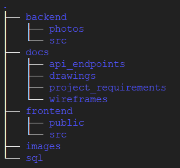

# Vet Application

A project for fulfilment of requirements for courses ENSF-607 and ENSF-608.


## Project Structure



+ [`build`](build) - contains back end source code

+ [`frontend`](frontend) - contains front end source code

+ [`sql`](sql) - contains MySQL database scripts

+ [`docs`](docs) - various documentation on the project


## Sprints

The table below summarizes all the sprint information

Sprint No  | Description                          | Due Date     | Information
-----          | -----                                | -----        | -----
1              | Developing epics and user stories    | 15-Oct-2021  | [Jira board](https://uofeng607-888.atlassian.net/jira/software/projects/U888/boards/1/roadmap)
2              | Designing the wire-frames            | 22-Oct-2021  | [Wireframes PPT](docs/wireframes/Wireframes_Consolidated.pptx)
3              | Designing the required API           | 19-Nov-2021  | [Postman file](docs/api_endpoints/VetApp.postman_collection.json) and [instructions](#how-to-run-backend)
4              | Developing front-end and back-end    | 03-Dec-2021  | *TBA*
5              | Integrating front-end and back-end   | 14-Dec-2021  | *TBA*


## How to run backend

Below are steps to get the backend service up and running.

1. Clone the repository to your local machine.

2. Start the MySQL server on your local machine. If you are accessing the MySQL server over a network, edit the property `spring.datasource.url` in the file [application.properties](build/src/main/resources/application.properties) and replace `localhost` with the server IP address.

3. Connect to your MySQL server using an admin user like `root`.

4. Run the below scripts on the MySQL server in the given order using `root`. These scripts will create a schema `vetdb`, a user `vetapp` with password `vetpassword`, create all necessary tables and load them with some dummy data.
   1. [01_init.sql](sql/01_init.sql)
   2. [02_tables.sql](sql/02_tables.sql)
   3. [03_views.sql](sql/03_views.sql)
   4. [04_dummy_data.sql](sql/04_dummy_data.sql)

5. On your machine, navigate to the directory [build](build). Running the below command will get the backend server running.
   ```bash
   $ mvn clean spring-boot:run
   ```

6. To test all the implemented API endpoints, launch Postman on your local machine.

7. Import [this](docs/api_endpoints/VetApp.postman_collection.json) file into the Postman. You can then run all the API endpoints in the imported folder **VetApp** one by one.

8. At any given time, you can also verify the db tables using the credentials mentioned in step #4.

9. Once the testing and verification is done, you may remove all the data from your MySQL server using [10_purge.sql](sql/10_purge.sql).


## Contributors

+ [Bhavyai Gupta](https://github.com/zbhavyai)
+ [Michael Lee](https://github.com/mlee2021)
+ [Sarang Kumar](https://github.com/sarangk3)
