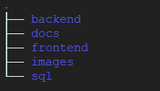

# Vet Application

A web application for managing Veterinary Clinic


## Features

+ Manage animals profiles, along with their owners

+ Manage user profiles like administrators, health technicians, attendants, teachers, and students

+ Each user having different access rights

+ Animal request workflow based on granted permissions


## Project Structure



+ [`backend`](backend) - contains back end source code
+ [`docs`](docs) - various documentation on the project
+ [`frontend`](frontend) - contains front end source code
+ [`images`](images) - contains images for README file
+ [`sql`](sql) - contains MySQL database scripts


## Dependencies

+ JDK version 11.0.11 or above
+ Maven version 3.6.3 or above
+ MySQL server version 8.0.26 or above
+ Node version 16.13.1 or above


## How to run

1. Clone the repository on your machine

2. Start the MySQL server on your local machine. If you are accessing the MySQL server over a network, edit the property `spring.datasource.url` in the file [application.properties](backend/src/main/resources/application.properties) and replace `localhost` with the server IP address.

3. Connect to your MySQL server using an admin user like `root`.

4. Run the below scripts on the MySQL server in the given order using `root`. These scripts will create a schema `vetdb`, a user `vetapp` with password `vetpassword`, create all necessary tables and load them with some dummy data.
   1. [01_init.sql](sql/01_init.sql)
   2. [02_tables.sql](sql/02_tables.sql)
   3. [03_views.sql](sql/03_views.sql)
   4. [04_dummy_data.sql](sql/04_dummy_data.sql)

5. To run the backend, navigate to the directory [backend](backend). Running the below command will get the backend server running.
   ```bash
   $ mvn clean spring-boot:run
   ```

6. To run the frontend, navigate to the directory [frontend](frontend). Running the below command will get the react server running and launch your default browser.
   ```bash
   $ npm install
   $ npm start
   ```

7. Once you are done with the application, you may remove all the data from your MySQL server using [10_purge.sql](sql/10_purge.sql).


## Contributors

+ [Bhavyai Gupta](https://github.com/zbhavyai)
+ [Michael Lee](https://github.com/mlee2021)
+ [Sarang Kumar](https://github.com/sarangk3)
